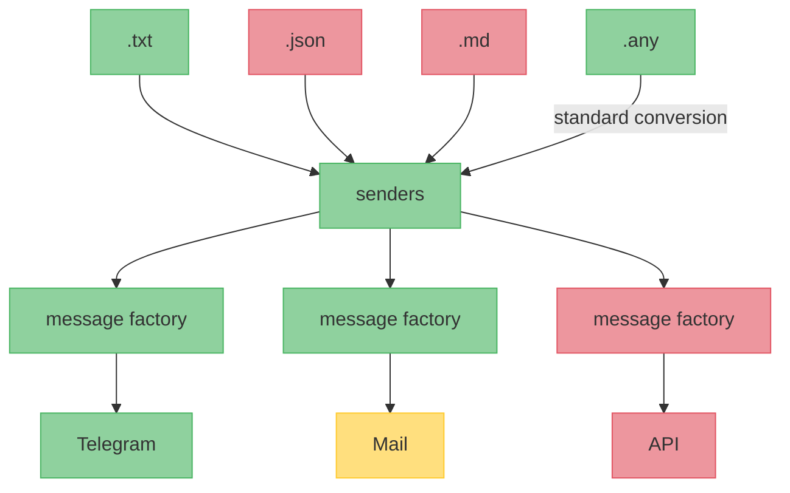

```mermaid
graph TD
A[.txt] --> AA[senders]
B[.json] --> AA
C[.md] --> AA
D[.any] -->|standard conversion| AA
AA --> AB[message factory]
AB --> Telegram
AA --> AC[message factory]
AC --> Mail
AA --> AD[message factory]
AD --> API
class A done;
class B todo;
class C todo;
class D done;
class AA done;
class AB done;
class AC done;
class AD todo;
class Telegram done;
class Mail in_progress
class API todo;

classDef done fill:#8fd19e,stroke:#4ab563;
classDef in_progress fill:#ffdf7e,stroke:#ffcb2f;
classDef todo fill:#ed969e,stroke:#e25563;
classDef aborted fill:#f7e1df,stroke:#ff5630;

```

