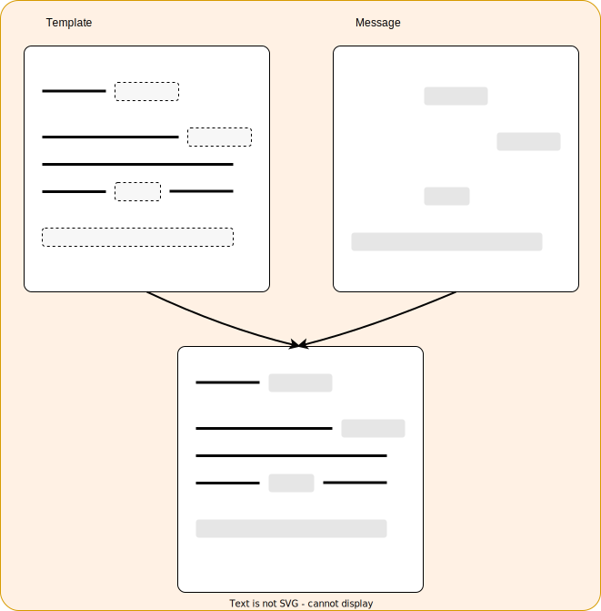

# Messages Sender

<p align="center">
<a href="https://github.com/psf/black/blob/main/LICENSE"></a>
<a href="https://github.com/psf/black"></a>
</p>


Format and send a message following a template.

## Description
Message sender is a library which create a message to send from a python dictionnary and a Jinja template and send it by [the method of your choice](##Send methods available).




## Getting Started

### Dependencies
* python3.8+

### Installing
```bash
pip install messages-sender
```

### Use it

Simple example:
```python
from messages_sender import SendBySMTP

SendBySMTP(port=465, sender_password="password", sender_email="senders@yolo.com").send("receiver@yolo.com", message="Yo")
```

Apply template
```python
from messages_sender import SendBySMTP
from jinja2 import Template


message = {
    "messages": ["Hello,", "The results of your analyse are available. Please follow the link to dowload the results."],
    "results": {"link": "https://github.com/Ermite28/messages_sender", "label": "⬇️ Get the results."},
    "greetings": "Ciao",
    "senders": {"info": "Ermite28"},
}

with open("templates/mail_template.j2") as template_file:
    template = Template(template_file.read())

SendBySMTP(port=465, sender_password="password", sender_email="senders@yolo.com").send(
    "receiver@yolo.com", message=message, template=template
)


```


## TODO

- [X] Maybe rethink about the library interface?
- [ ] Make more example template
- [X] Handle mails attached files.
- [ ] Better error handling.
- [X] Add unit test
- [X] should it handle file (config, template, message)? NO

## Send methods available

:white_check_mark: Telegram

:white_check_mark:  SMTP

:red_circle: local

:red_circle: Signal

:red_circle: RSS

:red_circle: SMS

:red_circle: Discord bot

:red_circle: message_senders API (futur project)


## License

This project is licensed under the MIT License - see the LICENSE.md file for details
