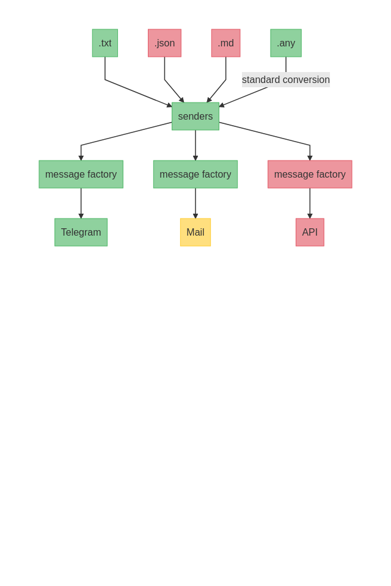

# Messages Sender
Send anythings anyhow.
:warning:  Still in development. The library part is not yet available.

## Description
Usefull tool / library to send any messages in any file format with any vector.
Architecture of the code was made to make easy to add a new file format or new way to send message.




## Getting Started

### Dependencies
* python3.8+

### Installing
```bash
git clone https://github.com/Ermite28/messages_sender
cd messages_sender
python -m venv .venv
source .venv/bin/activate
pip install -r requirements.txt
```

### Executing program

```
python send_message.py --client Benoit --file tests/test.txt --methods telegram
```

#### Credentials
if using as a tool:
.config in ini format:
```ìni
[TELEGRAM]
api_id = your api_id
api_hash = your api_hash
```

if using as a library
```python
config = {"TELEGRAM":{"api_id":"your api id", "api_hash":"your api_hash"}} 
```

## Help

Any advise for common problems or issues.
```
command to run if program contains helper info
```

## Authors

Contributors names and contact info

[Benoît de Witte](https://www.linkedin.com/in/beno%C3%AEt-de-witte-05202b170/)

## Version History

* 0.1
    * Initial Release
## TODO

- [ ] Add Mail senders ( In progress )
- [ ] Add API senders
- [ ] Handle markdown file
- [ ] Handle json file
- [ ] Use this tool as a tool or as a library
- [ ] db / json gestion


## License

This project is licensed under the MIT License - see the LICENSE.md file for details

## Acknowledgments
